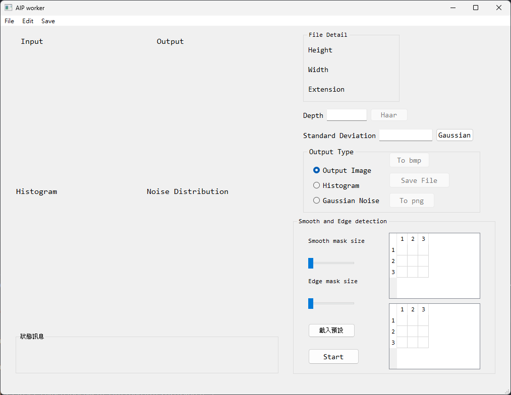

### AIP 功能重製版

#### 原始介面

1. 讀取影像 (顯示輸出影像)
   1. 影像的相關資訊
2. histogram(gray計算)
   1. 額外延伸: 三通道顯示、範圍區間處理(拖動 slider)
3. mask(邊緣偵測、模糊處理)，預設模板可以使用 combo box

### 子視窗的功能
跳出更複雜的選單
- 例如單獨的 mask 自定義(邊緣偵測、模糊處理) 